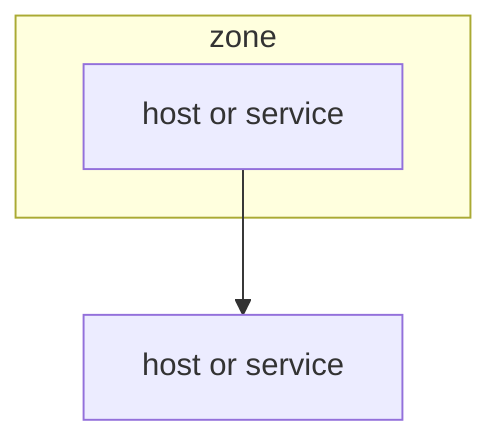

# Deployment view

<!-- 4+1 Physical / arc42 sec.7 + C4 Deployment.
     Topology + mapping of logical-view containers onto nodes.
     Reference containers by name; do not redefine responsibilities.
     Replace every `<...>` placeholder and example row, dropping the backticks unless the value is a literal.
     Delete guidance comments when done. -->

## Stakeholders & concerns

- `<roles (e.g. DevOps, infra, hardware)>`. Concerns: `<concerns this view frames>`

## Topology

<!-- Nodes/hosts/racks, networks, trust zones. -->

## Container -> node mapping

| Container | Node | Notes |
|-----------|------|-------|
| `<container>` | `<node>` | `<notes>` |

## Scaling & availability

- `<scaling approach, redundancy, availability targets>`

## Infrastructure constraints

<!-- Inherited from requirements (e.g. on-premise rack, no cloud, network isolation). -->
- `<constraint>`
