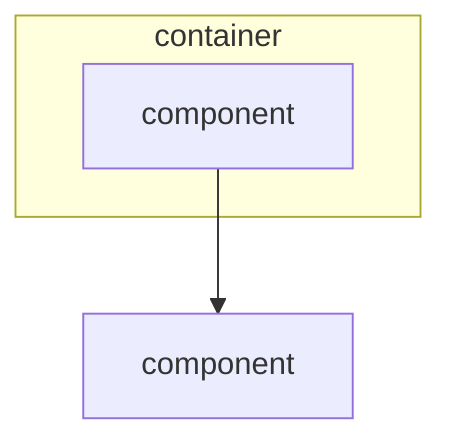

# Logical view

<!-- 4+1 Logical / arc42 sec.5 Building Block View.
     Static functional structure only - no deployment, no runtime sequencing.
     Map components to requirements agents by id.
     Replace every `<...>` placeholder and example row, dropping the backticks unless the value is a literal.
     Delete guidance comments when done. -->

## Stakeholders & concerns

- `<roles (e.g. frontend, backend)>`. Concerns: `<concerns this view frames>`

## Building block decomposition

<!-- Hierarchical.
     Containers -> components (C4).
     mermaid/ascii diagram. -->

## Components

### `<Component>`

- Responsibility: `<what it does>`
- Realizes (requirements agent): `<agent id, if any>`

## Interfaces

| Interface | Provider | Consumer(s) | Inputs -> Outputs | Purpose |
|-----------|----------|-------------|------------------|---------|
| `<name>` | `<component>` | `<component>` | `<in ->` out> | `<purpose>` |
