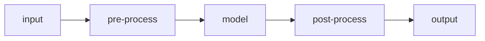

# ML serving view

<!-- CONDITIONAL - omit if no model inference.
     Trace inference steps to requirements operations by name.
     Note on-premise/edge constraints (local weights, no external model APIs).
     Replace every `<...>` placeholder and example row, dropping the backticks unless the value is a literal.
     Delete guidance comments when done. -->

## Stakeholders & concerns

- `<roles (e.g. ML engineer, infra)>`. Concerns: `<concerns this view frames>`

## Inference pipeline

<!-- End to end: input -> pre-process -> model(s) -> post-process -> output. -->

## Models

| Model | Role | Serving mode | Notes |
|-------|------|--------------|-------|
| `<model>` | `<role>` | `<batch/stream/real-time>` | `<notes>` |

## Hardware / accelerator plan

- `<GPU/accelerator resources, placement, capacity>`

## Model lifecycle

- `<versioning, update, rollback, evaluation gate>`

## Performance targets

- `<throughput/latency targets per model or pipeline>`
