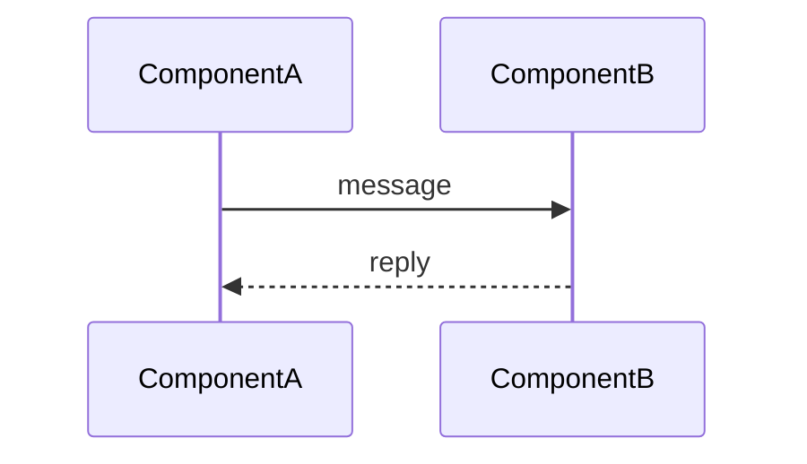

# Process view

<!-- 4+1 Process / arc42 sec.6 Runtime View.
     CONDITIONAL - omit if no non-trivial runtime/concurrency.
     Reference logical-view components by name; do not redefine them.
     Replace every `<...>` placeholder, dropping the backticks unless the value is a literal.
     Delete guidance comments when done. -->

## Stakeholders & concerns

- `<roles (e.g. backend, ML, QA)>`. Concerns: `<concerns this view frames>`

## Runtime / concurrency model

<!-- Processes, threads, queues, streams.
     Sync vs async.
     How units communicate. -->
`<description>`

## Runtime flows

### Flow: `<name>`  (operation: `<OperationName>`)

<!-- Sequence diagram (mermaid, per openspec/DIAGRAM-STYLE.md) - or Given/When/Then prose for simple flows. -->

## Timing & failure

<!-- Latency/timing constraints, backpressure, failure/retry on critical paths. -->
- `<timing or failure behavior>`
