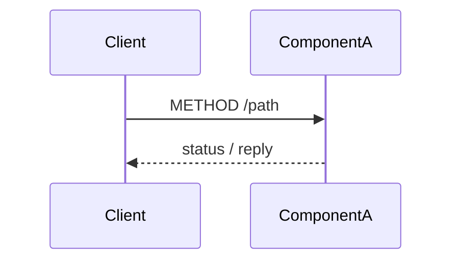

# Runtime sequences

<!-- This file lives at sequences/index.md.
     Index ONLY - every flow lives in a per-domain file (sequences/<domain>.md).
     Domains mirror the requirements scenarios domains where they exist, system seams otherwise.
     Replace every `<...>` placeholder; repeat the row per domain.
     Delete guidance comments when done. -->

| Domain | File | Scope |
|--------|------|-------|
| `<domain>` | `<domain>.md` | `<one-line scope>` |

## Per-domain file skeleton

<!-- Copy the block below (without the outer fence) into each sequences/<domain>.md,
     repeat the flow block per flow, then delete this section from the index. -->

````markdown
---
schema-version: 1.2.1
document-version: 0
---

# `<domain>` runtime sequences

<!-- Backend-internal flows that cross more than one component - happy path AND client-observable failure paths.
     COVERAGE (trigger closure): walk this domain's endpoints.md / events.md / jobs.md entries item by item -
     every state-changing trigger is shown in a flow or explicitly single-component;
     every outbound effect (publish, webhook, notification) appears in its trigger's flow.
     Lifelines use components.md names plus stores/brokers; messages name endpoints/channels.
     The client is at most ONE boundary lifeline (initial request, final response);
     client-side behavior lives in the frontend design's flows (API call sequences).
     UML Interaction semantics, rendered per openspec/rules/diagrams.md. -->

## `<Flow name>`

Realizes: `<endpoint(s)/channel(s)>` - traces to: `<requirements operation name>`



<!-- Failure path: only where it changes what the client observes (timeout, retry, partial failure, compensation).
     For event-producing writes, show WHEN the event is published relative to the write. -->

**Failure path**: `<what fails, what the client observes, recovery/compensation>`
````
