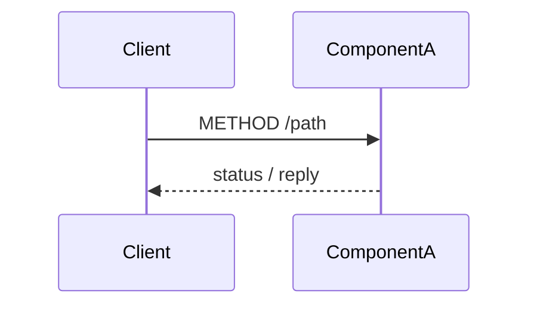

# Runtime sequences

<!-- Backend-internal flows that cross more than one component - happy path AND client-observable failure paths.
     Lifelines use components.md names plus stores/brokers; messages name endpoints/channels.
     The client is at most ONE boundary lifeline (initial request, final response);
     client-side behavior lives in the frontend design's flows (API call sequences).
     UML Interaction semantics, rendered per openspec/DIAGRAM-STYLE.md.
     Repeat the flow block per flow.
     Replace every `<...>` placeholder, dropping the backticks unless the value is a literal.
     Delete guidance comments when done. -->

## `<Flow name>`

Realizes: `<endpoint(s)/channel(s)>` - traces to: `<requirements operation name>`

<!-- Failure path: only where it changes what the client observes (timeout, retry, partial failure, compensation).
     For event-producing writes, show WHEN the event is published relative to the write. -->

**Failure path**: `<what fails, what the client observes, recovery/compensation>`
