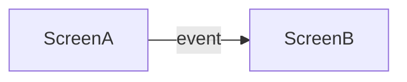
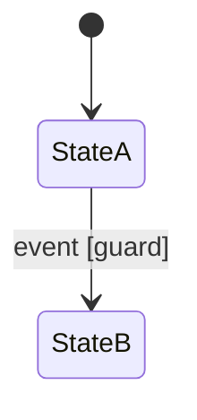

# Flows

<!-- Navigation map covers EVERY screen in screens.md.
     Statecharts only for non-trivial internal state.
     Diagrams per openspec/DIAGRAM-STYLE.md.
     Replace every `<...>` placeholder and example row, dropping the backticks unless the value is a literal.
     Delete guidance comments when done. -->

## Navigation map

<!-- Wireflow: screens as nodes, user events as labeled edges. -->

## Routes

<!-- Conditional section - only when the platform addresses screens by URL or deep link.
     Route names mirror the navigation map's nodes. -->
| Screen | Route pattern | Params | Guard | Deep-link entry |
|--------|---------------|--------|-------|-----------------|
| `<screen>` | `</path/:param>` | `<params>` | `<auth or ->` | `<state restored; where back leads>` |

## Event -> transition tables

<!-- Per screen, for transitions the map alone cannot carry (guards, parameters).
     IFML semantics. -->

### `<Screen name>`

| Event (on) | Guard | Action | Target |
|------------|-------|--------|--------|
| `<event (component)>` | `<condition or ->` | `<what happens>` | `<screen/state>` |

## Statecharts

<!-- ONLY for interactions with non-trivial internal state.
     UML state machine notation. -->

### `<Interaction name>`

Traces to: `<requirements operation/goal>`

