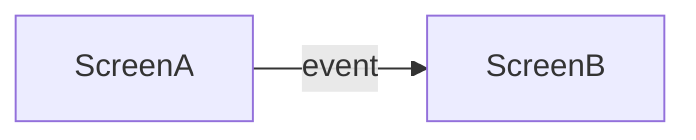
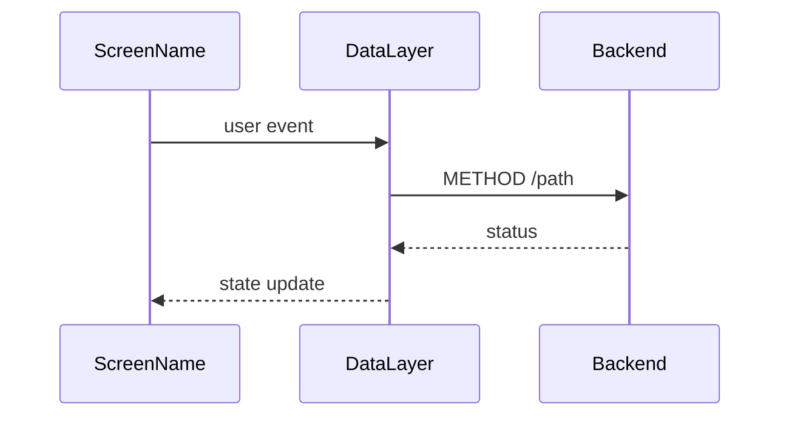
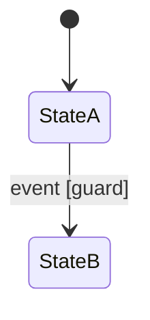

# Flows

<!-- This file lives at flows/index.md.
     Index ONLY - every flow lives in a per-domain file (flows/<domain>.md).
     A domain = a user journey or feature area.
     Replace every `<...>` placeholder; repeat the row per domain.
     Delete guidance comments when done. -->

| Domain | File | Scope |
|--------|------|-------|
| `<domain>` | `<domain>.md` | `<one-line scope>` |

## Per-domain file skeleton

<!-- Copy the block below (without the outer fence) into each flows/<domain>.md,
     keep each section scoped to the domain, then delete this section from the index. -->

````markdown
---
schema-version: 1.2.0
document-version: 0
---

# `<domain>` flows

<!-- The domain navigation maps jointly cover EVERY screen in screens.md;
     cross-domain edges name the target screen and its domain.
     Statecharts only for non-trivial internal state.
     Diagrams per openspec/rules/diagrams.md. -->

## Navigation map

<!-- Wireflow: this domain's screens as nodes, user events as labeled edges. -->


## Routes

<!-- Conditional section - only when the platform addresses screens by URL or deep link.
     Mechanism-agnostic: https URLs (iOS Universal Links / Android App Links) and custom
     schemes both fit the pattern column. The /.well-known association files that verify
     the domain (apple-app-site-association, assetlinks.json - RFC 8615) are a
     deployment/hosting concern - reference them, never specify them here.
     Route names mirror the navigation map's nodes.
     The fallback policy is stated once across the flows artifact - state it in one
     domain file and reference it from the others. -->
- **Fallback policy** *(stated once)*: `<app-absent chain, e.g. open web page / store redirect / smart banner; deferred deep-link service if the architecture decided one (ADR ref)>`

| Screen | Route pattern | Params | Guard | State restored | Back target | Fallback deviation |
|--------|---------------|--------|-------|----------------|-------------|--------------------|
| `<screen>` | `<https://... or scheme:///path/:param>` | `<params>` | `<auth or ->` | `<state>` | `<screen>` | `<- (policy) or per-route chain>` |

## Event -> transition tables

<!-- Per screen, for transitions the map alone cannot carry (guards, parameters).
     IFML semantics.
     Actions that call the backend name the endpoint verbatim (`METHOD /path`).
     COVERAGE: enumerate ALL trigger kinds per screen, not only user input -
     user events (each interactive component), arriving events (push, deep link,
     connectivity), temporal events (timers, expiry, polling), data events (fetch
     success/failure, revalidation, rollback). An unlisted trigger is a hole. -->

### `<Screen name>`

| Event (on) | Guard | Action | Target |
|------------|-------|--------|--------|
| `<event (component)>` | `<condition or ->` | `<what happens>` | `<screen/state>` |

## API call sequences

<!-- Conditional section - only when a flow drives backend calls whose order or failure
     behavior matters (multi-call submits, optimistic updates, retry-on-error).
     Client perspective: lifelines are the screen (screens.md name), the client data
     layer (data.md, when present), and the backend surface; messages name endpoints
     verbatim. Backend-internal component interaction lives in the backend design's
     sequences/. Repeat the flow block per flow. -->

### `<Flow name>`

Realizes: `<METHOD /path>` - traces to: `<requirements operation name>`



**Failure path**: `<what fails, what the user sees, retry/rollback>`

## Statecharts

<!-- ONLY for interactions with non-trivial internal state.
     UML state machine notation. -->

### `<Interaction name>`

Traces to: `<requirements operation/goal>`


````
