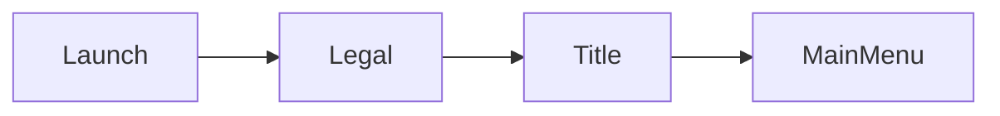
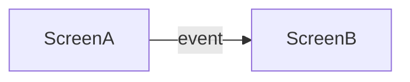
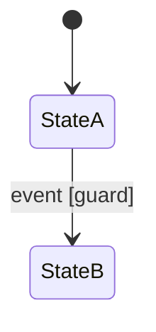

# Flows

<!-- Navigation map covers EVERY screen in screens.md.
     Statecharts only for non-trivial internal state.
     Diagrams per openspec/rules/diagrams.md.
     Replace every `<...>` placeholder and example row, dropping the backticks unless the value is a literal.
     Delete guidance comments when done. -->

## Boot flow

<!-- Launch -> legal/compliance placeholders (platform cert content is a project input)
     -> title -> first-boot setup -> main menu. -->

- First-boot setup: `<initial language/accessibility/settings prompts - which settings.md options surface>`

## Navigation map

<!-- Wireflow: screens as nodes, player events as labeled edges.
     Include gameplay <-> pause and menu -> gameplay returns. -->

## Modal & pause conventions

- Pause: `<what suspends gameplay; single/multiplayer difference>`
- Modal stack: `<what dismisses what; back/cancel semantics (shared with input.md)>`

## Event -> transition tables

<!-- Per screen, for transitions the map alone cannot carry (guards, parameters). -->

### `<Screen name>`

| Event (on) | Guard | Action | Target |
|------------|-------|--------|--------|
| `<event (widget)>` | `<condition or ->` | `<what happens>` | `<screen/state>` |

## Statecharts

<!-- ONLY for interactions with non-trivial internal state
     (matchmaking, purchase flows, multi-step character creation).
     UML state machine notation. -->

### `<Interaction name>`

Traces to: `<GDD section / requirements operation>`

