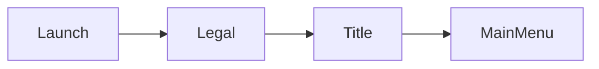
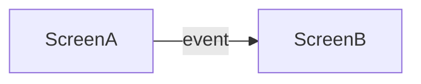
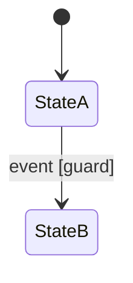

# Flows

<!-- This file lives at flows/index.md.
     Index ONLY - every flow lives in a per-domain file (flows/<domain>.md).
     A domain = a flow area: boot, gameplay, meta menus, settings.
     Replace every `<...>` placeholder; repeat the row per domain.
     Delete guidance comments when done. -->

| Domain | File | Scope |
|--------|------|-------|
| `<domain>` | `<domain>.md` | `<one-line scope>` |

## Per-domain file skeleton

<!-- Copy the block below (without the outer fence) into each flows/<domain>.md,
     keep each section scoped to the domain, then delete this section from the index. -->

````markdown
---
schema-version: 1.2.0
document-version: 0
---

# `<domain>` flows

<!-- The domain navigation maps jointly cover EVERY screen in screens.md;
     cross-domain edges name the target screen and its domain.
     Statecharts only for non-trivial internal state.
     Diagrams per openspec/rules/diagrams.md. -->

## Boot flow

<!-- Only in the boot domain's file.
     Launch -> legal/compliance placeholders (platform cert content is a project input)
     -> title -> first-boot setup -> main menu. -->


- First-boot setup: `<initial language/accessibility/settings prompts - which settings.md options surface>`

## Navigation map

<!-- Wireflow: this domain's screens as nodes, player events as labeled edges.
     Include gameplay <-> pause and menu -> gameplay returns. -->


## Modal & pause conventions

<!-- Stated once, in the domain that owns the pause/modal stack (typically gameplay);
     other domains reference it. -->

- Pause: `<what suspends gameplay; single/multiplayer difference>`
- Modal stack: `<what dismisses what; back/cancel semantics (shared with input.md)>`

## Event -> transition tables

<!-- Per screen, for transitions the map alone cannot carry (guards, parameters). -->

### `<Screen name>`

| Event (on) | Guard | Action | Target |
|------------|-------|--------|--------|
| `<event (widget)>` | `<condition or ->` | `<what happens>` | `<screen/state>` |

## Statecharts

<!-- ONLY for interactions with non-trivial internal state
     (matchmaking, purchase flows, multi-step character creation).
     UML state machine notation. -->

### `<Interaction name>`

Traces to: `<GDD section / requirements operation>`


````
