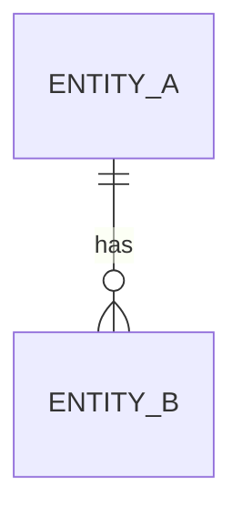

# Logical data model (detail)

<!-- Store-agnostic. Deepens architecture data-view entities to full field level.
     Logical types only - store-native mapping lives in stores.md.
     Replace every `<...>` placeholder and example row; repeat the entity block per entity.
     Delete guidance comments when done. -->

## Relationships

<!-- ONE ER diagram for the model (crow's foot cardinality).
     Relationship facts and cardinality live here only - entity blocks keep what
     the notation cannot carry. Split per data domain (overview) when one view
     no longer reads. -->

## `<Entity name>`

(data-view: `<entity>`; traces to: requirements object `<id>`)

| Field | Type (logical) | Constraints | Null |
|-------|----------------|-------------|------|
| `<field>` | `<string / integer / decimal / timestamp / ...>` | `<unique / range / format / ...>` | `<yes/no>` |

- **Integrity & cascade**: `<rules the diagram cannot carry - cascade intent, conditional integrity>`
- **Retention & PII**: `<class + retention window>` (invariant `<id>`)
