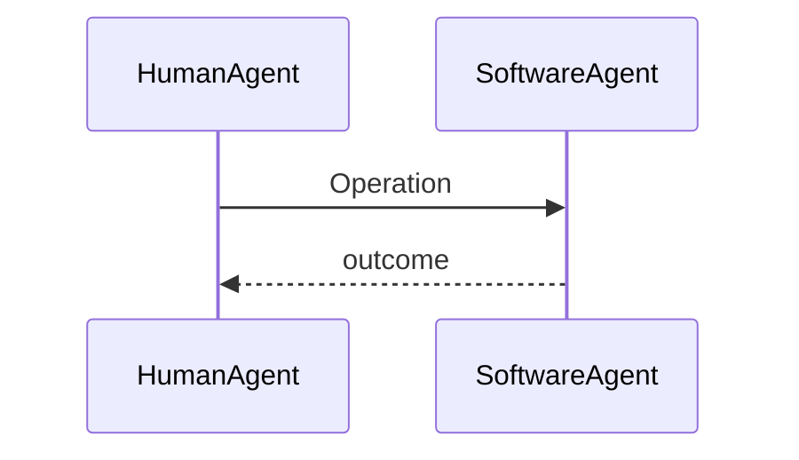

# Operational scenarios

<!-- This file lives at scenarios/index.md.
     Index ONLY - every scenario lives in a per-domain file (scenarios/<domain>.md).
     Domains mirror the goal model's top-level goals.
     Replace every `<...>` placeholder; repeat the row per domain.
     Delete guidance comments when done. -->

| Domain | File | Top-level goal |
|--------|------|----------------|
| `<domain>` | `<domain>.md` | `<G1>` |

## Per-domain file skeleton

<!-- Copy the block below (without the outer fence) into each scenarios/<domain>.md,
     repeat the scenario block per scenario, then delete this section from the index. -->

````markdown
---
schema-version: 1.2.0
document-version: 0
---

# `<domain>` operational scenarios

## Events

<!-- The domain's FULL trigger list - agent actions (walk the responsibility model),
     temporal events (schedules, deadlines, missed-expected-event probes), and
     arriving environment events (notification, callback, external data).
     Every event maps to exactly one scenario or an explicit "no response (why)";
     an empty Scenario cell is a hole. -->

| Event | Source | Scenario |
|-------|--------|----------|
| `<event>` | `<agent / schedule / environment>` | `<scenario name or no response (why)>` |

## `<Scenario name>`

Trigger: `<agent (responsibility-model name) or schedule/time condition>` - outcome: `<satisfied goal, by name>`



**Obstacle variant**: `<obstacle id - what changes in the interaction>` (only when a resolved obstacle changes it)
````
